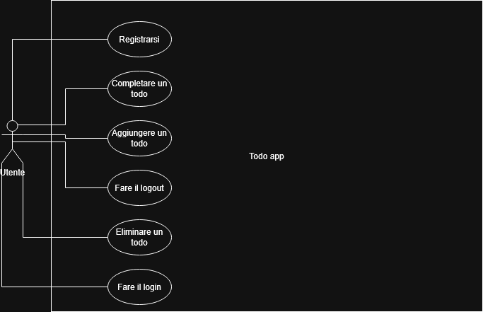

# Documentazione Todo App

## 1. Scenario Applicativo

La Todo App è un'applicazione web che permette agli utenti di gestire una lista di cose da fare. Ogni utente può registrarsi, effettuare il login e gestire i propri todo. Le attività di altri utenti non sono visibili grazie al sistema di autenticazione basato su JWT.

---

## 2. Architettura dell'Applicazione

L'applicazione segue un'architettura client-server con tre componenti principali:

- **Frontend** — applicazione React hostata su Vercel
- **Backend** — server Node.js + Express hostato su Render
- **Database** — MongoDB Atlas (cloud)

Il frontend comunica con il backend tramite chiamate HTTP. Il backend gestisce l'autenticazione e le operazioni sul database tramite Mongoose.

Frontend (Vercel)
↓ HTTP
Backend (Render)
↓ Mongoose
Database (MongoDB Atlas)

## Diagramma UML dei Casi d'Uso



---

## 3. Modello dei Dati

### User
| Campo | Tipo | Descrizione |
|-------|------|-------------|
| _id | ObjectId | Identificatore univoco generato da MongoDB |
| username | String | Nome utente, unico e obbligatorio |
| email | String | Email, unica e obbligatoria |
| password | String | Password criptata con bcrypt|

### Todo
| Campo | Tipo | Descrizione |
|-------|------|-------------|
| _id | ObjectId | Identificatore univoco generato da MongoDB |
| task | String | Testo del todo, obbligatorio |
| completed | Boolean | Stato del todo, default false |
| userId | ObjectId | Riferimento all'utente proprietario del todo |

---

## 4. Documentazione API

La documentazione completa e interattiva delle API è disponibile su Swagger:
🔗 https://todo-app-h7zx.onrender.com/api-docs

### Autenticazione

| Metodo | Route | Descrizione | Autenticazione |
|--------|-------|-------------|----------------|
| POST | /auth/register | Registra un nuovo utente | No |
| POST | /auth/login | Effettua il login e restituisce un token JWT | No |

#### POST /auth/register
**Body:**
```json
{
  "username": "mario",
  "email": "mario@example.com",
  "password": "ciao123"
}
```
**Risposta 201:**
```json
{
  "message": "User successfully registered",
  "user": {
    "id": "64f1a2b3c4d5e6f7g8h9i0j1",
    "username": "mario",
    "email": "mario@example.com"
  }
}
```

#### POST /auth/login
**Body:**
```json
{
  "email": "mario@example.com",
  "password": "ciao123"
}
```
**Risposta 200:**
```json
{
  "token": "eyJhbGciOiJIUzI1NiIsInR5cCI6IkpXVCJ9...",
  "user": {
    "id": "64f1a2b3c4d5e6f7g8h9i0j1",
    "username": "mario",
    "email": "mario@example.com"
  }
}
```

### Todo

> Tutte le route dei todo richiedono autenticazione tramite token JWT nell'header:
> `Authorization: Bearer <token>`

| Metodo | Route | Descrizione |
|--------|-------|-------------|
| GET | /todos | Restituisce tutti i todo dell'utente loggato |
| POST | /todos | Crea un nuovo todo |
| PUT | /todos/:id | Aggiorna lo stato di un todo |
| DELETE | /todos/:id | Elimina un todo |

#### GET /todos
**Risposta 200:**
```json
[
  {
    "_id": "64f1a2b3c4d5e6f7g8h9i0j1",
    "task": "studiare",
    "completed": false,
    "userId": "64f1a2b3c4d5e6f7g8h9i0j2"
  }
]
```

#### POST /todos
**Body:**
```json
{
  "task": "studiare"
}
```
**Risposta 201:**
```json
{
  "_id": "64f1a2b3c4d5e6f7g8h9i0j1",
  "task": "studiare",
  "completed": false,
  "userId": "64f1a2b3c4d5e6f7g8h9i0j2"
}
```

#### PUT /todos/:id
**Body:**
```json
{
  "completed": true
}
```
**Risposta 200:**
```json
{
  "_id": "64f1a2b3c4d5e6f7g8h9i0j1",
  "task": "studiare",
  "completed": true,
  "userId": "64f1a2b3c4d5e6f7g8h9i0j2"
}
```

#### DELETE /todos/:id
**Risposta 200:**
```json
{
  "message": "Todo eliminato"
}
```

---

## 5. Componenti React

### App.js
Componente principale — gestisce lo stato dell'autenticazione. Se il token è presente mostra `TodoList`, altrimenti mostra `Login` o `Register`.

### Login.js
Componente per il login — contiene un form con email e password. Dopo il login salva il token in `App.js` tramite la prop `onLogin`.

### Register.js
Componente per la registrazione — contiene un form con username, email e password. Chiama l'API di registrazione quando l'utente clicca il bottone.

### TodoList.js
Componente principale della lista — carica i todo dal backend con `useEffect`, gestisce le operazioni di aggiunta, aggiornamento ed eliminazione e le passa come props ai componenti figli.

### TodoItem.js
Componente per il singolo todo — mostra la checkbox, il testo e il bottone elimina. Riceve il todo e le funzioni di aggiornamento ed eliminazione come props da `TodoList`.

### AddTodo.js
Componente per aggiungere un nuovo todo — contiene un input e un bottone. Passa il testo del nuovo todo a `TodoList` tramite la prop `onAdd`.

---

## 6. Credenziali per il Test

**Utente di test:**
- Email: `test@test.com`
- Password: `ciao123`

**Link:**
- Frontend: https://todo-app-a1234.vercel.app
- Backend : https://todo-app-h7zx.onrender.com
- Documentazione Swagger: https://todo-app-h7zx.onrender.com/api-docs

**Se non funziona subito aspettare qualche minuto**